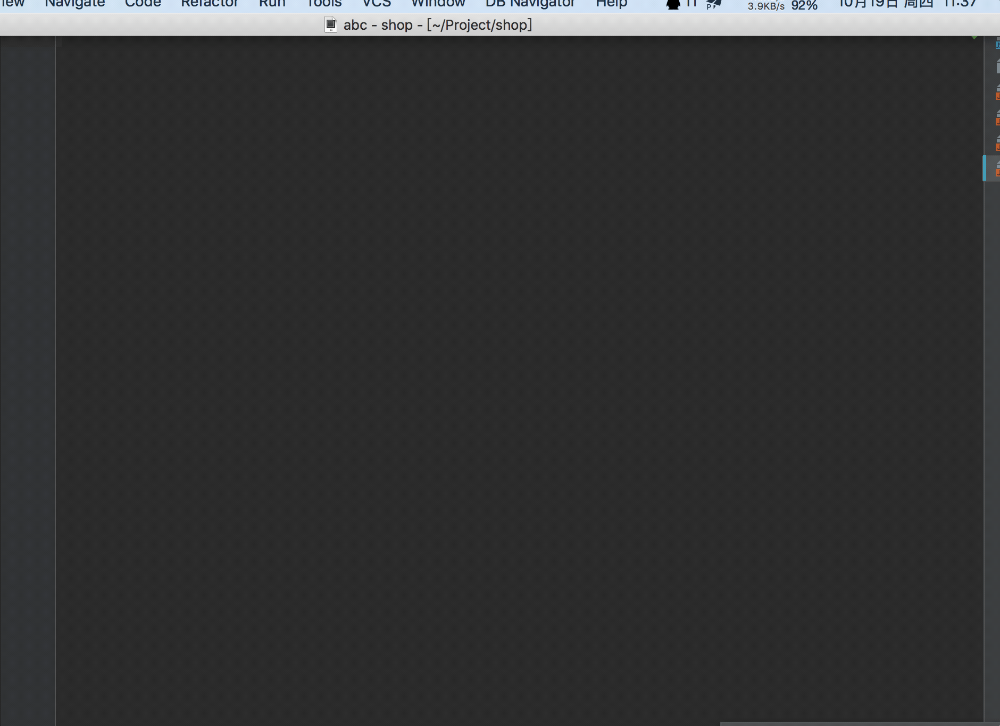
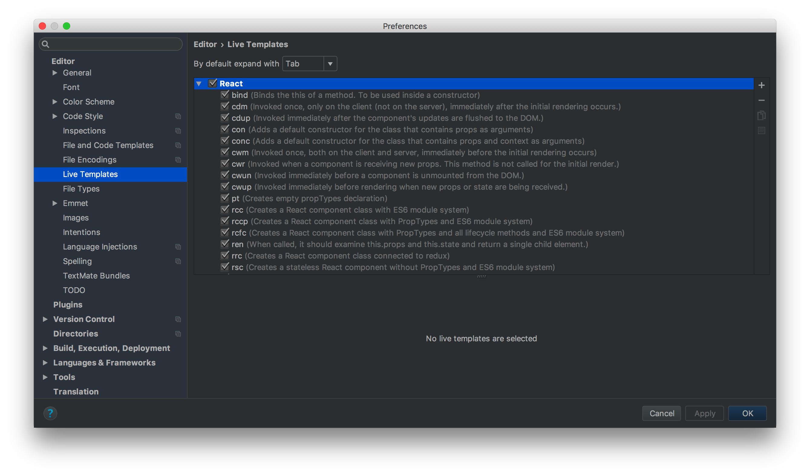
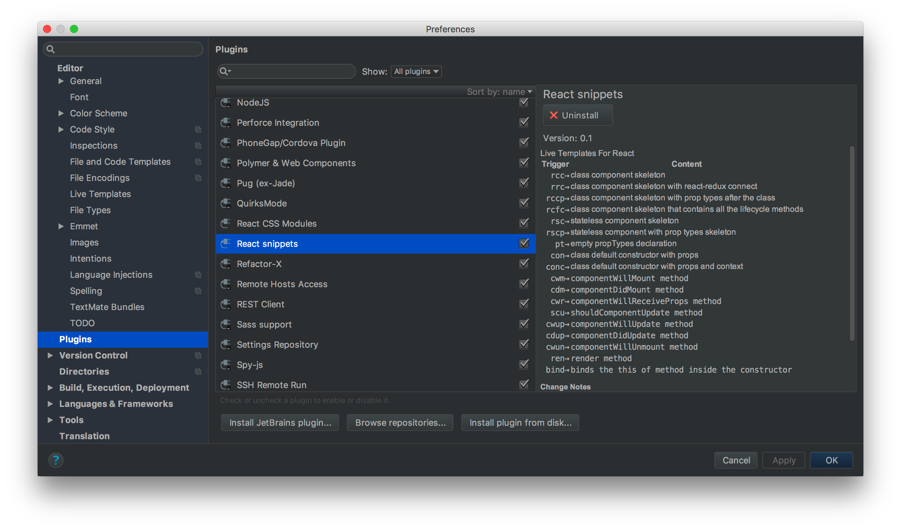

# ReactSnippets
Live Templates for React in IntelliJ products webstorm and idea.

| Trigger | Content |
| --- | --- |
| `rcc` | class component skeleton |
| `rrc` | class component skeleton with react-redux connect |
| `rccp` | class component skeleton with prop types after the class |
| `rcfc` | class component skeleton that contains all the lifecycle methods |
| `rsc` | stateless component skeleton |
| `rscp` | stateless component with prop types skeleton |
| `pt` | empty propTypes declaration |
| `con` | class default constructor with props |
| `conc` | class default constructor with props and context |
| `cwm` | `componentWillMount` method |
| `cdm` | `componentDidMount` method |
| `cwr` | `componentWillReceiveProps` method |
| `scu` | `shouldComponentUpdate` method |
| `cwup` | `componentWillUpdate` method |
| `cdup` | `componentDidUpdate` method |
| `cwun` | `componentWillUnmount` method |
| `ren` | `render` method |
| `bind` | binds the `this` of method inside the constructor |
| `hoc` | higher-order component |
| `cref` | creates a ref. |
| `cctx` | creates a context |

Add all the snippets that can be used for prop types.

| Trigger | Content |
| --- | --- |
| `pta` | `PropTypes.array,` |
| `ptar` | `PropTypes.array.isRequired,` |
| `ptb` | `PropTypes.bool,` |
| `ptbr` | `PropTypes.bool.isRequired,` |
| `ptf` | `PropTypes.func,` |
| `ptfr` | `PropTypes.func.isRequired,` |
| `ptn` | `PropTypes.number,` |
| `ptnr` | `PropTypes.number.isRequired,` |
| `pto` | `PropTypes.object,` |
| `ptor` | `PropTypes.object.isRequired,` |
| `pts` | `PropTypes.string,` |
| `ptsr` | `PropTypes.string.isRequired,` |
| `ptnd` | `PropTypes.node,` |
| `ptndr` | `PropTypes.node.isRequired,` |
| `ptel` | `PropTypes.element,` |
| `ptelr` | `PropTypes.element.isRequired,` |
| `pti` | `PropTypes.instanceOf(ClassName),` |
| `ptir` | `PropTypes.instanceOf(ClassName).isRequired,` |
| `pte` | `PropTypes.oneOf(['News', 'Photos']),` |
| `pter` | `PropTypes.oneOf(['News', 'Photos']).isRequired,` |
| `ptet` | `PropTypes.oneOfType([PropTypes.string, PropTypes.number]),` |
| `ptetr` | `PropTypes.oneOfType([PropTypes.string, PropTypes.number]).isRequired,` |
| `ptao` | `PropTypes.arrayOf(PropTypes.number),` |
| `ptaor` | `PropTypes.arrayOf(PropTypes.number).isRequired,` |
| `ptoo` | `PropTypes.objectOf(PropTypes.number),` |
| `ptoor` | `PropTypes.objectOf(PropTypes.number).isRequired,` |
| `ptsh` | `PropTypes.shape({color: PropTypes.string, fontSize: PropTypes.number}),` |
| `ptshr` | `PropTypes.shape({color: PropTypes.string, fontSize: PropTypes.number}).isRequired,` |

Hooks

All hooks from [official docs](https://reactjs.org/docs/hooks-reference.html) are supported with hook name prefix.
